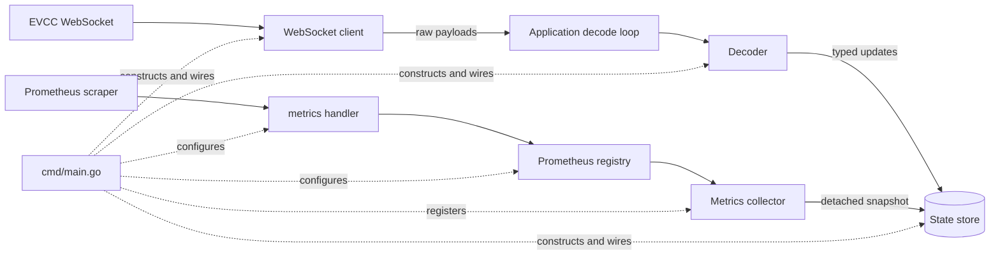

# Architecture

```mermaid
flowchart LR
    evcc[EVCC WebSocket] --> client[WebSocket client]
    client -->|raw payloads| loop[Application decode loop]
    loop --> decoder[Decoder]
    decoder -->|typed updates| store[(State store)]

    prometheus[Prometheus scraper] --> handler[metrics handler]
    handler --> registry[Prometheus registry]
    registry --> collector[Metrics collector]
    collector -->|detached snapshot| store

    main[cmd/main.go] -. constructs and wires .-> client
    main -. constructs and wires .-> decoder
    main -. constructs and wires .-> store
    main -. registers .-> collector
    main -. configures .-> registry
    main -. configures .-> handler
```