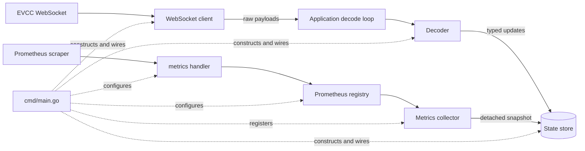

# EVCC Prometheus exporter

Exports selected [EVCC](https://evcc.io/) WebSocket state as Prometheus gauges. EVCC's state schema documents power in W, energy in kWh, current in A, SoC in percent, and vehicle range and odometer in km. Values are exported without unit conversion.

## Configuration

| Environment variable | Default | Description |
| --- | --- | --- |
| `EVCC_WS_URL` | `wss://demo.evcc.io/ws` | EVCC WebSocket URL |
| `EVCC_SOURCE_ID` | `default` | Stable label value identifying this EVCC source |
| `PROMETHEUS_ADDR` | `:9070` | HTTP listen address; metrics are served at `/metrics` |

Run one exporter process per EVCC source. The `source_id` label lets Prometheus distinguish sources when their metrics are combined.

## Architecture

## Metrics

All metrics are gauges. Every series includes `source_id` and its entity ID label. The legacy metric `battery_soc` keeps its name and value semantics; its label set now also includes `source_id`.

| Metric | Entity label | Meaning |
| --- | --- | --- |
| `battery_soc` | `battery_id` | Battery state of charge, percent |
| `evcc_pv_power_watts` | `pv_id` | PV meter power, W |
| `evcc_pv_energy_kwh` | `pv_id` | PV meter energy, kWh |
| `evcc_consumer_power_watts` | `consumer_id` | Consumer meter power, W |
| `evcc_consumer_energy_kwh` | `consumer_id` | Consumer meter energy, kWh |
| `evcc_grid_power_watts` | `grid_id` | Grid meter power, W |
| `evcc_grid_energy_kwh` | `grid_id` | Grid meter energy, kWh |
| `evcc_grid_current_amperes` | `grid_id`, `phase` | Grid current per phase, A; phase labels start at `1` |
| `evcc_chargepoint_charging` | `chargepoint_id` | Charging state, `0` or `1` |
| `evcc_chargepoint_connected` | `chargepoint_id` | Vehicle connection state, `0` or `1` |
| `evcc_chargepoint_power_watts` | `chargepoint_id` | Charge point power, W |
| `evcc_chargepoint_charged_energy_kwh` | `chargepoint_id` | Energy charged in the current session, kWh |
| `evcc_vehicle_soc_percent` | `chargepoint_id` | Vehicle SoC, percent |
| `evcc_vehicle_range_kilometers` | `chargepoint_id` | Vehicle range, km |
| `evcc_vehicle_odometer_kilometers` | `chargepoint_id` | Vehicle odometer, km |

Meter IDs use EVCC's stable device `name`; a missing grid meter name uses `grid`. Charge point IDs use the configured loadpoint `name`, falling back to its WebSocket index until the name arrives. Vehicle metrics use the associated charge point ID because EVCC reports vehicle values on loadpoints; the mutable vehicle name is not a label.

EVCC list updates replace that entity category: entities omitted from the new list stop being exported, while omitted fields on retained IDs preserve their previous values. A `null` field clears only that value; a `null` entity list clears the category. Vehicle metrics clear when the loadpoint disconnects or its vehicle name is cleared. A `loadpoints.<index>: null` update removes that charge point.